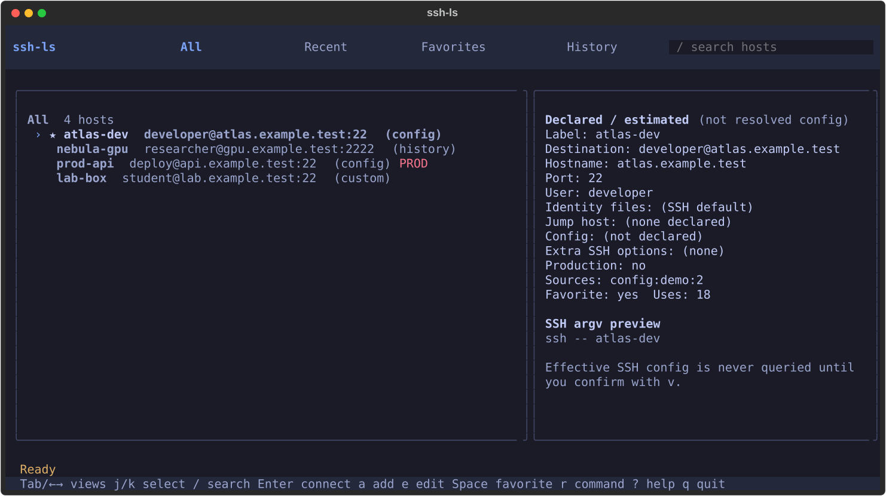

# ssh-ls

A keyboard-first SSH host picker for macOS and Linux. `ssh-ls` brings configured hosts and candidate destinations from local shell history into one compact Textual interface, then hands a selected connection to the system OpenSSH client. It is an independent MIT-licensed rewrite inspired by [akinoiro/ssh-list](https://github.com/akinoiro/ssh-list); no source code is reused.



## What it does

- Reads literal host aliases from OpenSSH config and supported `Include` files. OpenSSH remains the connection-settings source of truth; ssh-ls does not edit your original SSH config. Displayed values are estimates; use the confirmed `ssh -G` preview to inspect OpenSSH’s effective configuration.
- Search/filter, sort/reorder, favorite, add, edit, clone, and hide hosts in All, Recent, Favorites, and History views; no groups or tags. Local custom hosts and app-specific overrides live in ssh-ls state.
- Parses a conservative subset of zsh/bash history into candidate host fields only. The UI shows candidates; metadata is saved on user actions such as favoriting, editing, hiding, or attempting a connection. It never executes or replays a command from history.
- `r` lets you explicitly enter a remote command for the selected host. Native `ssh` is launched only after the picker exits, returning control to your shell when the session ends.
- Provides a demo mode with synthetic hosts and no real config, history, or network access.

## Install

Requires Python 3.11 or newer and an OpenSSH client on `PATH`.

With [uv](https://docs.astral.sh/uv/):

```sh
uv tool install git+https://github.com/Moviw/ssh-ls.git
ssh-ls
```

Or with pipx:

```sh
pipx install git+https://github.com/Moviw/ssh-ls.git
ssh-ls
```

For local development:

```sh
git clone https://github.com/Moviw/ssh-ls.git
cd ssh-ls
uv sync
uv run ssh-ls --demo
```

## Keyboard controls

| Key | Action |
| --- | --- |
| `j` / `k`, `↑` / `↓` | Move through hosts |
| `Tab` / `←` / `→` | Change tab |
| `Space` | Toggle favorite |
| `/` | Search |
| `s` | Open the sort menu |
| `Enter` | Connect to the selected host |
| `a` / `e` / `c` / `Delete` | Add / edit / clone / delete a host |
| `m` | Enter reorder mode (`j`/`k` or arrows; `Esc` finishes) |
| `r` | Enter a remote command to run |
| `i` | Reload hosts from config |
| `o` | Open settings |
| `v` | Inspect effective OpenSSH options (`ssh -G`) after confirmation |
| `U` / `H` | Reset host overrides / restore hidden hosts |
| `g` | Run the local doctor check |
| `?` | Show help |
| `q` / `Esc` | Quit or close the current view |

The UI shows the relevant shortcuts in its footer. Destructive actions ask for confirmation.

## CLI

```text
ssh-ls [--config PATH] [--history PATH ...] [--no-history] [--demo]
       [--doctor] [--ascii] [--version]
```

- `--config PATH` selects an alternate OpenSSH config.
- `--history PATH` may be repeated to choose shell history files explicitly.
- `--no-history` disables history discovery for that run.
- `--demo` uses synthetic data and avoids reading real SSH config/history or making network connections.
- `--doctor` checks local setup without connecting to a host.
- `--ascii` uses ASCII borders and indicators for limited terminal fonts.

Run `ssh-ls --help` for the installed CLI's exact options. To uninstall a uv-installed copy, run `uv tool uninstall ssh-ls`.

## Privacy and local state

History discovery accepts only a conservative subset of direct `ssh` commands. It does not evaluate shell expansions; assignment-prefixed commands such as `NAME=value ssh host` are skipped. Relative `-i` identity paths and `-F` config paths that cannot be resolved from the history context are rejected. Parsed command text is discarded: history is never executed or replayed, including any remote-command text. The `r` action runs only a remote command you explicitly enter in the UI. Examples and demo data use reserved `.test` names, not real hostnames or credentials.

Per-user UI state is stored under `${XDG_CONFIG_HOME:-~/.config}/ssh-ls/state.json`. The application creates private state directories/files (0700/0600 on POSIX) and keeps `state.json.bak` when it updates state. SSH credentials and private keys remain under your normal OpenSSH setup; ssh-ls does not ask you to paste private-key material into its state file.

On an existing OpenSSH alias, identity paths added as ssh-ls overrides are passed as additional `-i` arguments. Clearing the ssh-ls override removes those app-added arguments; it does not remove or rewrite `IdentityFile` values in native SSH config.

## Development and checks

```sh
uv sync
uv run python -m unittest discover -s tests -v
uv build
```

The CI workflow runs the unit suite and package build on Linux and macOS with Python 3.11 and 3.14, plus an isolated native OpenSSH integration check on Ubuntu. `docs/verification.md` describes smoke checks and safety boundaries; it is a checklist, not a claim that a command has already passed.

## Restore app state or uninstall

`ROLLBACK.sh` restores only a disposable app-state copy from its sibling `.bak` file; it does not delete the project or inspect/touch SSH config, keys, or other `~/.ssh` data. For example, `./ROLLBACK.sh "$STATE_COPY"` expects `"$STATE_COPY.bak"` to be the preserved baseline. Close ssh-ls before restoring any state copy so a running app cannot later write stale state. Do not point the script at a live state file unless you intentionally want the backup to replace it.

Uninstall a uv tool installation with `uv tool uninstall ssh-ls`.

## Design references and attribution

The visual direction draws on [awesome-tui-design](https://github.com/cola-runner/awesome-tui-design) (Tokyo Night, Catppuccin, and Nord design notes) and interaction patterns in [Truffle Glyph](https://truffleagent.com/glyph/). Glyph currently provides Go/Bubble Tea components; ssh-ls is Python/Textual and reimplements applicable patterns rather than importing Glyph code. The theme documents are design references, not bundled code.

## License

MIT. See [LICENSE](LICENSE).
