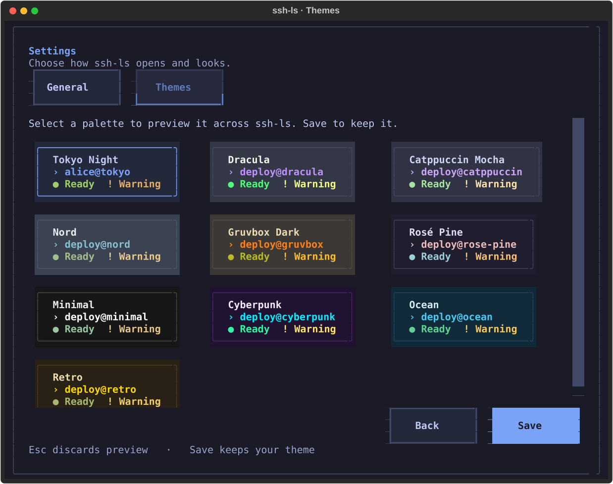

# ssh-ls

**Stop digging through shell history for that SSH command.**

[中文](README.zh-CN.md) · [Usage](docs/usage.md) · [Contributing](docs/development.md)

[](https://github.com/Moviw/ssh-ls/actions/workflows/ci.yml)
[](LICENSE)

I didn't want to keep typing `ssh ...`. My SSH config and shell history already held the destinations—I wanted to pick one instead of remembering which alias or command to type.

## Pick a host. Press Enter.

Run `ssh-ls` to see hosts from your SSH config and supported commands in your bash or zsh history. Type `/` to search, move with `j` / `k` or the arrow keys, and press `Enter`. The picker closes and your system's `ssh` takes over. When the session ends, you're back at your shell.

Star the hosts you use often. **Recent** combines connection attempts in ssh-ls with hosts found in your shell history, with known timestamps sorted newest first. Config and history stay unchanged; ssh-ls keeps its own favorites and connection metadata.

Your existing OpenSSH setup still handles keys, agents, jump hosts, and authentication. ssh-ls is a host picker, not another SSH client or password vault.


*Fictional demo data. Try it without reading your SSH files: `ssh-ls --demo`.*

## Install

Requires macOS or Linux, curl, and OpenSSH.

```sh
curl -fsSL https://raw.githubusercontent.com/Moviw/ssh-ls/main/install.sh | sh
ssh-ls
```

The installer uses [uv](https://docs.astral.sh/uv/) to create an isolated environment. If needed, it installs uv and downloads Python 3.11. No sudo, Git, or preinstalled Python is required. It leaves your shell profiles, SSH files, and ssh-ls settings alone. If the command directory isn't on your PATH, it prints the full executable path.

The installer uses the latest stable GitHub Release. Run `ssh-ls update` to update, or `ssh-ls uninstall` to remove the app after confirmation. Both keep your settings and SSH files. To inspect the script before running it:

```sh
curl -fsSL https://raw.githubusercontent.com/Moviw/ssh-ls/main/install.sh -o install.sh
less install.sh
sh install.sh
```

Already using uv or pipx? Install the same stable release with Python 3.11+:

```sh
uv tool install https://github.com/Moviw/ssh-ls/releases/latest/download/ssh-ls.tar.gz
# or
pipx install https://github.com/Moviw/ssh-ls/releases/latest/download/ssh-ls.tar.gz
```

## The keys you'll actually use

| Key | Action |
| --- | --- |
| `/` | Search by name, host, user, or jump host |
| `j` / `k`, `↑` / `↓` | Select a host |
| `Tab`, `←` / `→` | All · Recent · Favorites |
| `Enter` | Connect |
| `Space` | Toggle favorite |
| `o` | Settings and theme gallery |
| `?` | Show all shortcuts |
| `q` | Quit |

The picker opens on **Recent** by default. Click **Settings** or press `o` to choose Recent, Favorites, or All as your start page, pick a theme, and adjust accent color, row spacing, and ASCII display.

Tokyo Night is the default. The **Themes** tab shows a preview card for each preset, including Dracula, Catppuccin Mocha, Nord, Gruvbox Dark, Rosé Pine, Minimal, Cyberpunk, Ocean, and Retro. Select a card to preview it, then Save to keep it; Esc discards the preview.



You can also add, edit, clone, hide, and reorder hosts; sort the list; run an explicit remote command; and adjust the accent color or row spacing. [Full controls and CLI options →](docs/usage.md)

Interactive launches check GitHub for a newer stable release in the background. If one is available, a small banner shows the version and `ssh-ls update`. No automatic update, no SSH data sent, and no interruption when offline. Demo mode stays offline. Built-in update and uninstall support official uv installs; pipx and source installs use their own manager.

## A few things to know

**Will it change my SSH config?** No. Edits are local overrides stored under `${XDG_CONFIG_HOME:-~/.config}/ssh-ls/`. OpenSSH remains the source of truth for connection behavior. Displayed config fields are estimates; `v` offers an explicit effective-config preview.

**Does it replay commands from my history?** No. The importer extracts connection fields from a conservative subset of SSH commands. It discards remote commands and skips shell substitutions, environment assignments, and relative key/config paths whose original working directory is unknown. Some history entries will not appear.

**Will it connect in the background?** No. Opening the picker doesn't probe servers or run `ssh -G`. Connection starts when you choose a host. Hosts you mark as production require confirmation.

**Does this replace my terminal workflow?** No. Native `ssh` inherits your terminal, and ssh-ls preserves its exit status. There is no cloud account, sync service, or separate credential store.

## Contributing

Bug reports and small, focused pull requests are welcome. Include your OS, Python version, and a fictional config or history example that reproduces the problem—never private keys or real shell history. See the [development guide](docs/development.md).

*Dedicated to my research days in Nakayama Lab.*
