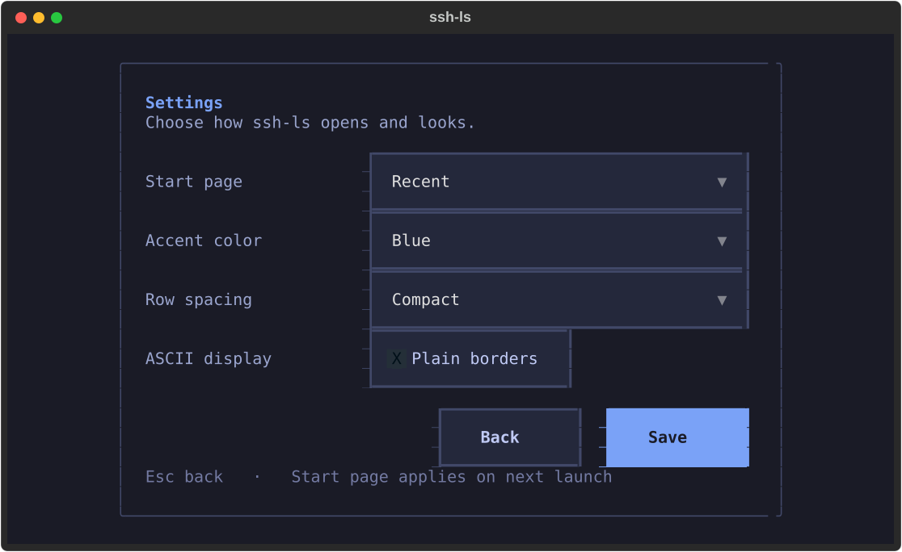

# Usage

## Keyboard controls

| Key | Action |
| --- | --- |
| `j` / `k`, `↑` / `↓` | Move through hosts |
| `Tab` / `Shift+Tab`, `←` / `→` | Change tab |
| `Space` | Toggle favorite |
| `/` | Search; `Esc` returns to navigation |
| `s` | Sort menu |
| `Enter` | Connect |
| `a` / `e` / `c` / `Delete` | Add / edit / clone / delete or hide |
| `m` | Reorder with `j` / `k` or arrows; `Esc` finishes |
| `r` | Enter a remote command |
| `i` | Reload sources |
| `o` / **Settings** button | Start page, accent color, row spacing, ASCII display |
| `v` | Effective OpenSSH configuration, after confirmation |
| `U` | Reset selected host's discovered-field overrides |
| `H` | Restore hidden discovered hosts |
| `d` | Details, including on narrow terminals |
| `g` | Local diagnostics |
| `?` | Help |
| `q` | Quit |

Shortcuts are inactive while editing text. Delete/hide and reset operations require confirmation. Production status is a manual flag, not something inferred from a hostname. Recent usage records connection attempts, not proof of successful authentication.

## Views and preferences

The three views are **All**, **Recent**, and **Favorites**. Recent combines connection attempts made in ssh-ls and destinations discovered from shell history. Known timestamps sort newest first; history entries without timestamps remain available at the end. There is no separate History tab.

The default start page is Recent. Open the **Settings** page using its button or `o`, choose your start page, and select **Save**. The choice applies on the next launch; Back or Esc discards changes. Existing favorites and other metadata remain intact.



Source references are grouped by file and consecutive line range, such as `config:~/.ssh/config:44–49`. Nonconsecutive lines are kept separate, and provenance data stays unchanged.

## CLI

```text
ssh-ls [--config PATH] [--history PATH ...] [--no-history]
       [--demo] [--doctor] [--ascii] [--version]
```

- `--config PATH`: use an alternate config, also passed to `ssh -F`.
- `--history PATH`: choose a history file; repeat for several files.
- `--no-history`: don't read shell history.
- `--demo`: fictional hosts, in-memory state, no SSH execution.
- `--doctor`: local checks without connecting.
- `--ascii`: ASCII borders and indicators.

## Config and history

The picker discovers literal `Host` aliases and follows `Include` files. Wildcard patterns are not expanded into imaginary hosts. It does not evaluate `Match` conditions or implement OpenSSH's complete resolution rules. Native SSH resolves the selected alias at connection time, including options that the picker doesn't display.

`v` runs `ssh -G` only after you confirm. Trusted SSH config matters: `Match exec` may execute local commands even during a configuration preview.

History parsing supports simple connection arguments such as `-p`, `-l`, `-i`, `-J`, and `-F`, plus a small allowlist of `-o` settings. An omitted port stays omitted when launching SSH. The parser skips unsupported options, shell operators/substitutions, environment assignments, and cwd-dependent key/config paths. It never saves raw history lines or replays their remote commands. The `r` action is for a command you explicitly enter now; its syntax is interpreted by the remote shell.

Deduplication is conservative. Exact matching alias references may be merged, but different usernames, ports, identities, or configs can remain separate. No DNS probes are used to guess whether two destinations are the same server.

## Local state

App-owned state lives at `${XDG_CONFIG_HOME:-~/.config}/ssh-ls/state.json`. Updates use a file lock and atomic replacement, keep a previous-state backup, and use private POSIX permissions. Corrupt state is reported rather than overwritten.

Editing a discovered host creates an override, not a change to `.ssh/config`. Deleting a discovered host hides it; deleting a custom entry removes that entry. `U` resets discovered fields; `H` unhides source entries.

An identity override adds `-i` arguments to native SSH. It does **not** remove `IdentityFile` entries in your SSH config; clearing the override leaves those native entries in effect. Advanced SSH options are passed to OpenSSH, so use options and configurations you trust.

## Installation and updates

The curl installer installs the latest `main` branch into a uv tool environment. It reuses uv on your PATH (or `~/.local/bin/uv`), and otherwise downloads the official [uv installer](https://docs.astral.sh/uv/reference/installer/) with shell-profile changes disabled. Python 3.11 is downloaded if needed. It doesn't connect to SSH hosts or access your config, history, or app state.

```sh
curl -fsSL https://raw.githubusercontent.com/Moviw/ssh-ls/main/install.sh | sh
```

Rerun this command to update. It refreshes the source archive and upgrades dependencies; it does not install a numbered release or verify a project release signature. For a fixed revision, use uv with a Git commit instead of the moving `main` branch.

The command normally lands in `~/.local/bin`. If that directory isn't on PATH, use the full path printed by the installer, or add the directory yourself. For bash/zsh with the default location:

```sh
export PATH="$HOME/.local/bin:$PATH"
```

Put that line in your shell's startup file if you want it to persist. Alternatively, `uv tool update-shell` can configure PATH for you; unlike our installer, that command edits your shell profile.

To remove the installed command:

```sh
uv tool uninstall ssh-ls
```

If uv isn't on PATH, run `~/.local/bin/uv tool uninstall ssh-ls`. Uninstalling ssh-ls leaves uv, any downloaded Python, your local state, and SSH files untouched.
